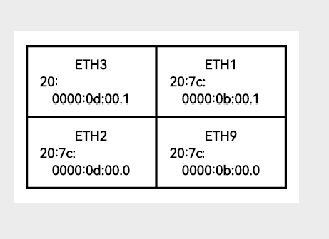

# Physical Port Labeling Tips

Correctly labeling your NIC ports can save you hours during deployment, debugging, or passthrough setup. Qotom and similar multi-NIC appliances often have inconsistent or missing labels, and port order does not always match `ethX` numbering.

This guide helps you create clear, accurate port labels using the output from `xcp-ng-nic-labeler`.

## Recommended Tools

- **Preferred Label Printer:** [Nimbot B1 on Amazon](https://amzn.to/3RpxfwQ) _(affiliate link)_
- **Label Tape:** 6mm or 12mm waterproof thermal tape
- **Label Format:** Grid-style or stacked blocks

Other handheld or PC-based label printers can be used — the key is producing clear, legible, and durable labels that can be applied in tight hardware spaces.

## What to Include on Each Label

For each NIC, include:

- Interface name (`ethX`)
- MAC address
- PCI address (for passthrough or physical mapping)

Example:

```text
ETH4
ba:dd:c0:ff:ee:01
0000:04:00.0
```

## Layout Tips

- Match your label layout to the **physical layout** of the device — not `ethX` numbering.
- Group ports into logical label blocks and print them together.
- Refer to `eth_pci_mapping.md` to generate each label set.

## Optional Enhancements

- Add secondary labels to indicate VLAN, IP, or purpose (e.g., WAN, MGMT, VM).
- Use color coding (e.g., red dot for WAN, green for LAN).
- Store a copy of the label mapping in your `docs/` folder or asset archive.

## Example from Qotom Deployment

Here is a real-world example showing label layout on a Qotom 9-NIC appliance:

```text
ETH4       ETH5       NA
ba:dd:c0:ff:ee:01   ba:dd:c0:ff:ee:02
0000:04:00.0        0000:05:00.0

ETH8       ETH6       ETH7
ba:dd:c0:ff:ee:05   ba:dd:c0:ff:ee:03   ba:dd:c0:ff:ee:04
0000:08:00.0        0000:06:00.0        0000:07:00.0
```

You can print this as a single block using the Nimbot B1 app or a PC layout tool.

## Visual Example: Label Grid Placement

Below are real-world examples from a Qotom Q20352G9 (model C3908) showing grouped NIC labeling using the Nimbot B1.

These labels include:

- `ethX` interface name
- MAC address
- PCI address

Printed in logical layout blocks using the Nimbot app, then applied above the NICs in their physical positions.

### Full Rack Application


### SFP+ Port Label Block (ETH1–ETH3, ETH9)



### Ethernet Port Label Block (ETH4–ETH8)


If you'd like to contribute your own layout or visual guide, open a pull request or send us a photo.

## Summary

Clear port labeling ensures:

- Accurate passthrough setup
- Easier cabling and maintenance
- Faster diagnostics and less guesswork

_Note: The MAC addresses shown in these examples are randomized for documentation purposes and do not reflect real hardware._

If you'd like to contribute a label layout, open a pull request or email us a photo!
